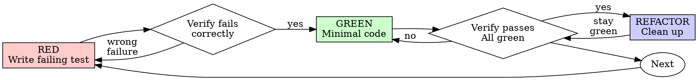

# Test-Driven Development (TDD)

## Overview

Write the test first. Watch it fail. Write minimal code to pass.

**Core principle:** If you didn't watch the test fail, you don't know if it tests the right thing.

**Violating the letter of the rules is violating the spirit of the rules.**

## When to Use

**Always:**
- New modules, layers, loss functions
- Bug fixes
- Refactoring
- Training loop changes
- Data pipeline modifications

**Exceptions (ask your human partner):**
- Throwaway prototypes / architecture search
- Generated code
- Configuration files
- Hyperparameter sweeps

Thinking "skip TDD just this once"? Stop. That's rationalization.

## The Iron Law

```
NO PRODUCTION CODE WITHOUT A FAILING TEST FIRST
```

Write code before the test? Delete it. Start over.

**No exceptions:**
- Don't keep it as "reference"
- Don't "adapt" it while writing tests
- Don't look at it
- Delete means delete

Implement fresh from tests. Period.

## Red-Green-Refactor



### RED - Write Failing Test

Write one minimal test showing what should happen.

<Good>
```python
def test_residual_block_preserves_shape(sample_batch):
    block = ResidualBlock(channels=16)
    out = block(sample_batch)
    assert out.shape == sample_batch.shape
```
Clear name, tests real behavior, one thing
</Good>

<Bad>
```python
def test_residual_block(sample_batch):
    block = ResidualBlock(channels=16)
    out = block(sample_batch)
    assert out.shape == sample_batch.shape
    assert out.dtype == torch.float32
    loss = out.sum()
    loss.backward()
    for p in block.parameters():
        assert p.grad is not None
```
Tests multiple behaviors at once — split into separate tests
</Bad>

**Requirements:**
- One behavior
- Clear name describing what's tested
- Small tensors, fast execution

### Verify RED - Watch It Fail

**MANDATORY. Never skip.**

```bash
pytest tests/test_residual.py::test_residual_block_preserves_shape -x
```

Confirm:
- Test fails (not errors)
- Failure message is expected
- Fails because feature missing (not typos)

**Test passes?** You're testing existing behavior. Fix test.

**Test errors?** Fix error, re-run until it fails correctly.

### GREEN - Minimal Code

Write simplest code to pass the test.

<Good>
```python
class ResidualBlock(nn.Module):
    def __init__(self, channels: int):
        super().__init__()
        self.conv1 = nn.Conv2d(channels, channels, 3, padding=1)
        self.conv2 = nn.Conv2d(channels, channels, 3, padding=1)

    def forward(self, x: Tensor) -> Tensor:
        return x + self.conv2(F.relu(self.conv1(x)))
```
Just enough to pass
</Good>

<Bad>
```python
class ResidualBlock(nn.Module):
    def __init__(
        self, channels: int, *,
        groups: int = 1,
        norm: str = "batch",
        activation: str = "relu",
        dropout: float = 0.0,
        se_ratio: float | None = None,
    ):
        # YAGNI — no test requires any of this
```
Over-engineered
</Bad>

Don't add features, refactor other code, or "improve" beyond the test.

### Verify GREEN - Watch It Pass

**MANDATORY.**

```bash
pytest tests/test_residual.py -x
```

Confirm:
- Test passes
- Other tests still pass
- Output pristine (no errors, warnings)

**Test fails?** Fix code, not test.

**Other tests fail?** Fix now.

### REFACTOR - Clean Up

After green only:
- Remove duplication
- Improve names
- Extract helpers

Keep tests green. Don't add behavior.

### Repeat

Next failing test for next feature.

## Good Tests

| Quality | Good | Bad |
|---------|------|-----|
| **Minimal** | One thing. "and" in name? Split it. | `test_validates_shape_and_dtype_and_gradients` |
| **Clear** | Name describes behavior | `test_model_1` |
| **Fast** | Small tensors (batch=4, tiny dims) | Full-size ImageNet inputs |
| **Deterministic** | Seeded or tolerance-based | Flaky due to random init |
| **Shows intent** | Demonstrates desired API | Obscures what code should do |

## DL-Specific TDD Patterns

### Decomposing a Module into Tests

A neural network module isn't one behavior — break it down:

```
ResidualBlock
  → test shape preservation    (RED → GREEN)
  → test gradient flow         (RED → GREEN)
  → test residual connection   (RED → GREEN)
  → test batch independence    (RED → GREEN)
  → REFACTOR
```

Write one test, implement just enough, repeat. Don't implement the full module then test it.

### Numerical Tolerance

DL code is floating-point — use tolerances, not exact equality:

```python
def test_layer_norm_normalizes(sample_batch):
    norm = nn.LayerNorm(sample_batch.shape[1:])
    out = norm(sample_batch)
    assert torch.allclose(out.mean(dim=-1), torch.zeros(4), atol=1e-5)
    assert torch.allclose(out.std(dim=-1), torch.ones(4), atol=1e-1)
```

### Determinism

Seed random state when test outcomes depend on initialization:

```python
@pytest.fixture
def sample_batch():
    torch.manual_seed(42)
    return torch.randn(4, 3, 32, 32)
```

Don't seed everything globally — only where randomness affects assertions.

### Testing on Available Devices

```python
DEVICE = torch.device("cuda" if torch.cuda.is_available() else "cpu")

@pytest.mark.skipif(not torch.cuda.is_available(), reason="CUDA not available")
def test_model_runs_on_gpu(model, sample_batch):
    model = model.to("cuda")
    out = model(sample_batch.to("cuda"))
    assert out.device.type == "cuda"
```

### Testing Loss Decreases

The simplest training sanity check — if loss doesn't decrease, something is broken:

```python
def test_loss_decreases(model, sample_batch, target_batch):
    opt = torch.optim.SGD(model.parameters(), lr=0.01)
    loss_fn = nn.CrossEntropyLoss()

    initial_loss = loss_fn(model(sample_batch), target_batch).item()
    for _ in range(50):
        loss = loss_fn(model(sample_batch), target_batch)
        opt.zero_grad(); loss.backward(); opt.step()

    assert loss.item() < initial_loss * 0.5, "Loss didn't decrease enough"
```

### Companion Skill: test-nn-components

The **test-nn-components** skill defines the five critical checks for neural network code:
1. Output shape (including batch=1 edge case)
2. Gradient flow
3. Single-batch overfit
4. Batch independence
5. Data pipeline sanity

Use test-nn-components to decide **what** to test. Use this TDD skill for **how** to work — write each check as a failing test first, then implement.

## Why Order Matters

**"I'll write tests after to verify it works"**

Tests written after code pass immediately. Passing immediately proves nothing:
- Might test wrong thing
- Might test implementation, not behavior
- Might miss edge cases you forgot
- You never saw it catch the bug

Test-first forces you to see the test fail, proving it actually tests something.

**"I already tested it in a notebook"**

Notebook testing is ad-hoc:
- No record of what you tested
- Can't re-run when code changes
- Cell execution order matters — "it worked when I ran it" ≠ reproducible
- Notebook state accumulates — variables from earlier cells mask bugs

Automated tests are systematic. They run the same way every time.

**"Deleting X hours of work is wasteful"**

Sunk cost fallacy. The time is already gone. Your choice now:
- Delete and rewrite with TDD (X more hours, high confidence)
- Keep it and add tests after (30 min, low confidence, likely bugs)

The "waste" is keeping code you can't trust. Working code without real tests is technical debt.

**"TDD doesn't work for ML — you need to experiment"**

Experimentation and TDD serve different phases:
- **Experiment** in notebooks to find the right architecture/hyperparameters
- **Implement** with TDD once you know what to build
- Throw away the notebook code. Implement fresh from tests.

**"Tests after achieve the same goals — it's spirit not ritual"**

No. Tests-after answer "What does this do?" Tests-first answer "What should this do?"

Tests-after are biased by your implementation. You test what you built, not what's required.

Tests-first force edge case discovery before implementing.

30 minutes of tests after ≠ TDD. You get coverage, lose proof tests work.

## Common Rationalizations

| Excuse | Reality |
|--------|---------|
| "Too simple to test" | Simple code breaks. Test takes 30 seconds. |
| "I'll test after" | Tests passing immediately prove nothing. |
| "Already tested in notebook" | Ad-hoc ≠ systematic. Cell order masks bugs. |
| "Deleting X hours is wasteful" | Sunk cost fallacy. Keeping unverified code is technical debt. |
| "Keep as reference, write tests first" | You'll adapt it. That's testing after. Delete means delete. |
| "Need to explore first" | Fine. Throw away exploration, start with TDD. |
| "Test hard = design unclear" | Listen to test. Hard to test = hard to use. |
| "TDD will slow me down" | TDD faster than debugging silent numerical errors. |
| "TDD doesn't work for ML" | TDD covers implementation. Experimentation is separate. |
| "The model trains, so it works" | Training ≠ correct. Silent bugs hide in accuracy noise. |

## Red Flags - STOP and Start Over

- Code before test
- Test after implementation
- Test passes immediately
- Can't explain why test failed
- Tests added "later"
- Rationalizing "just this once"
- "I already tested it in the notebook"
- "Tests after achieve the same purpose"
- "Keep as reference" or "adapt existing code"
- "Already spent X hours, deleting is wasteful"
- "TDD is dogmatic, I'm being pragmatic"
- "The model trains fine without tests"
- "This is different because..."

**All of these mean: Delete code. Start over with TDD.**

## Example: Bug Fix

**Bug:** Model outputs wrong shape when batch_size=1

**RED**
```python
@torch.no_grad()
def test_output_shape_batch_one(model):
    x = torch.randn(1, 3, 32, 32)
    out = model(x)
    assert out.shape == (1, 10), f"Expected (1, 10), got {out.shape}"
```

**Verify RED**
```bash
$ pytest tests/test_model.py::test_output_shape_batch_one -x
FAILED: Expected (1, 10), got (10,)
```

**GREEN**
```python
def forward(self, x: Tensor) -> Tensor:
    x = self.features(x)
    x = x.flatten(1)  # was x.squeeze() — removed batch dim when B=1
    return self.classifier(x)
```

**Verify GREEN**
```bash
$ pytest tests/test_model.py -x
PASSED
```

**REFACTOR**
None needed — minimal change.

## Verification Checklist

Before marking work complete:

- [ ] Every new function/method has a test
- [ ] Watched each test fail before implementing
- [ ] Each test failed for expected reason (feature missing, not typo)
- [ ] Wrote minimal code to pass each test
- [ ] All tests pass
- [ ] Output pristine (no errors, warnings)
- [ ] Used small tensors and fast execution
- [ ] Edge cases covered (batch=1, empty input, device placement)

Can't check all boxes? You skipped TDD. Start over.

## When Stuck

| Problem | Solution |
|---------|----------|
| Don't know what to test | Use **test-nn-components** — the 5 checks. |
| Test too slow | Smaller tensors, fewer steps. Mark slow tests with `@pytest.mark.slow`. |
| Flaky due to randomness | Seed with `torch.manual_seed`. Use tolerances (`atol`, `rtol`). |
| Hard to test in isolation | Extract the layer/block. If it's tangled, the design needs work. |
| Need real data to test | You don't. Use `torch.randn` / `torch.randint`. Real data is for training. |
| Test setup too complex | Use pytest fixtures. Still complex? Simplify the module interface. |

## Debugging Integration

Bug found? Write failing test reproducing it. Follow TDD cycle. Test proves fix and prevents regression.

Never fix bugs without a test.

## Testing Anti-Patterns

When adding mocks or test utilities, read @testing-anti-patterns.md to avoid common pitfalls:
- Testing synthetic data properties instead of model behavior
- Adding test-only methods to production modules
- Over-mocking when small tensors suffice

## Final Rule

```
Production code → test exists and failed first
Otherwise → not TDD
```

No exceptions without your human partner's permission.
